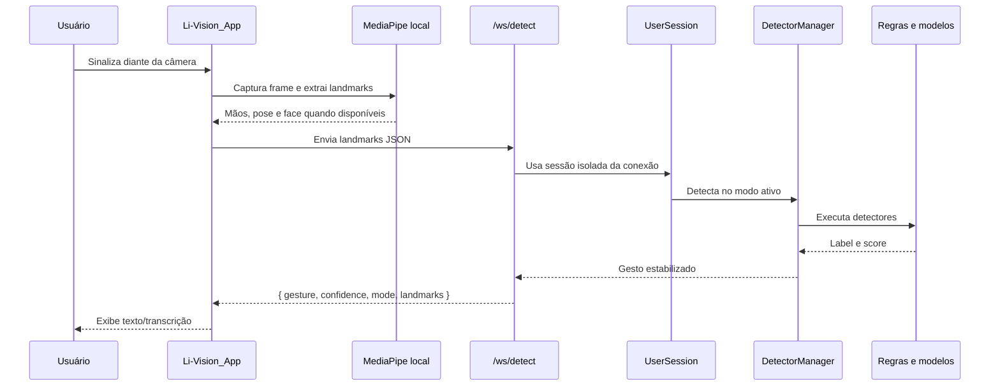

# Fluxo de dados

Esta página descreve o caminho dos dados desde a câmera do usuário até o texto exibido pelo aplicativo.

## Fluxo principal de inferência



## Entrada enviada pela aplicação

O contrato histórico do WebSocket aceita uma lista de mãos:

```json
[
  [
    { "x": 0.1, "y": 0.2, "z": 0.0 }
  ]
]
```

Cada mão contem 21 landmarks. O backend também possui suporte para entrada holistica v2, com mãos, corpo e rosto, quando o cliente envia esses canais.

## Resposta da API

Resposta normal:

```json
{
  "gesture": "A",
  "confidence": 0.92,
  "mode": "hybrid",
  "landmarks": []
}
```

Resposta de erro controlado:

```json
{
  "gesture": null,
  "confidence": 0.0,
  "landmarks": [],
  "error": "Mensagem do erro"
}
```

## Sessão por conexão

Cada conexão WebSocket cria uma `UserSession`. Essa decisao evita que histórico temporal, cooldown, buffers de coleta ou modo de detecção de um usuário interfiram em outro.

Cada sessão mantem:

| Estado | Função |
| --- | --- |
| `detection_mode` | Modo ativo: `rules`, `ml`, `dynamic_ml` ou `hybrid`. |
| `active_model_name` | Modelo/idioma selecionado pelo app, quando informado. |
| `use_rules` | Permite habilitar ou desabilitar regras lógicas na sessão. |
| `detector_manager` | Orquestrador de detectores com histórico e cooldown próprios. |
| `collection_service` | Buffer isolado para coleta dinamica. |

## Coleta estatica

1. O app envia uma imagem ou landmarks para uma letra/sinal sem movimento.
2. A API extrai features da mão.
3. O `CollectionService` cria ou localiza o dataset.
4. A amostra e salva no Supabase com `dataset_id`, `label`, `features` e, quando disponível, `user_id`.

## Coleta dinamica

1. O app envia a acao `start_collect`.
2. A sessão passa a acumular frames.
3. Cada frame vira um vetor de features.
4. Ao atingir a janela configurada, normalmente 15 frames, a sequência e salva.
5. O app envia `stop_collect` para encerrar a sessão de coleta.

## Treinamento

O treinamento usa datasets salvos no Supabase:

| Tipo de dataset | Modelo treinado | Formato resultante |
| --- | --- | --- |
| `static` | `MLPClassifier` do scikit-learn | `.joblib` |
| `dynamic` | GRU bidirecional em PyTorch | `.pt` |

Ao final, a API registra o modelo, acurácia, relatório de classificação, total de amostras e caminho de armazenamento.

## Ativacao de modelos

Quando um modelo e ativado, o backend baixa o artefato do Supabase Storage para os diretórios locais configurados:

| Tipo | Diretório padrão |
| --- | --- |
| Estático | `models/static` |
| Dinâmico | `models/dynamic` |

Depois disso, novas sessoes podem carregar os detectores correspondentes pelo cache global de modelos.
