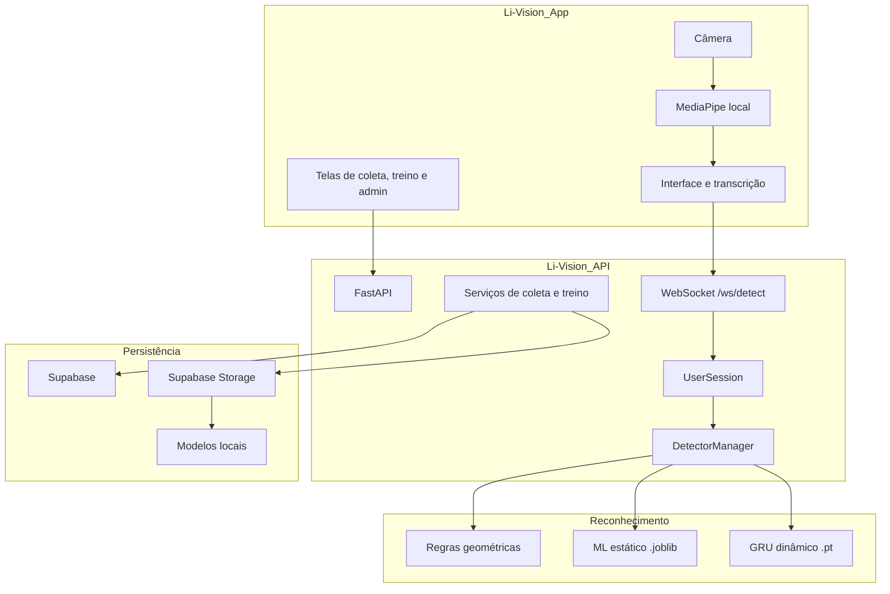

# Arquitetura geral

O Li-Vision é composto por um aplicativo mobile, um backend Python e uma documentação MkDocs. A arquitetura foi desenhada para traduzir sinais de Libras para texto em tempo real, mas também inclui coleta de dados, treinamento de modelos, módulo de aprendizado e administração.

## Visão em camadas

## Componentes

| Componente | Responsabilidade |
| --- | --- |
| App mobile | Capturar sinais, extrair landmarks, mostrar transcrição, coletar datasets e operar telas administrativas. |
| MediaPipe local | Converter frames da câmera em pontos anatômicos normalizados. |
| API FastAPI | Expor REST/WebSocket, autenticar usuários, classificar gestos e gerenciar dados. |
| AppState | Manter recursos compartilhados do backend, como configuração, pipeline e cache de modelos. |
| UserSession | Isolar estado de cada conexão WebSocket. |
| DetectorManager | Executar detectores e estabilizar resultados no tempo. |
| CollectionService | Salvar amostras estaticas e dinamicas. |
| TrainingService | Treinar, registrar e ativar modelos. |
| Supabase | Persistir usuários, datasets, amostras, modelos, jobs e gestos educacionais. |

## Princípios arquiteturais

| Principio | Aplicação no projeto |
| --- | --- |
| Separação de responsabilidades | App cuida da experiência e extração local; API cuida de classificação, dados e modelos. |
| Estado por sessão | Cada WebSocket tem detectores e buffers próprios. |
| Pipeline extensível | Novos detectores podem ser adicionados sem reescrever a captura. |
| Modos configuráveis | `rules`, `ml`, `dynamic_ml` e `hybrid` permitem evolução gradual. |
| Coleta integrada | O mesmo app usado para tradução também alimenta datasets. |

## Referências do repositório

Os nomes com `_` são usados como referências para variações do mesmo repositório:

| Referência | Descrição |
| --- | --- |
| `Li-Vision_API` | Variação da API consumida pelo aplicativo. |
| `Li-Vision_App` | Variação da aplicação mobile Expo/React Native. |
| `Li-Vision_Docs` | Variação da documentação MkDocs. |
| `Li-Vision_Principal` | Variação principal/base Python relacionada ao backend. |

## Risco de divergência

`Li-Vision_API` e `Li-Vision_Principal` possuem muitos arquivos equivalentes. Isso é útil como referência, mas exige cuidado: uma correção aplicada apenas em uma variação pode não chegar à outra.

Para mudanças futuras, documente explicitamente qual base é fonte de verdade para deploy, testes locais e desenvolvimento.
