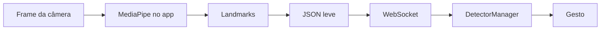
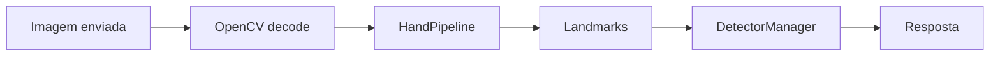

# Pipeline de processamento

A pipeline transforma entrada visual em dados numericos que os detectores conseguem interpretar.

No Li-Vision existem dois caminhos principais:

1. **App mobile**: extrai landmarks no dispositivo e envia somente os pontos para a API.
2. **Backend**: também consegue receber imagem/frame, processar com `HandPipeline` e detectar no servidor.

## Pipeline preferencial: edge computing



Esse caminho reduz trafego porque envia landmarks em vez de imagens completas.

## Pipeline server-side

O backend mantem `HandPipeline` para processar imagens quando recebe frames ou uploads:



## HandPipeline

`HandPipeline` fica em `src/vision/pipeline.py` nas bases Python. Ela encapsula o MediaPipe Hand Landmarker.

Responsabilidades:

| Etapa | Descrição |
| --- | --- |
| Carregar modelo | Usa `models/mediapipe/hand_landmarker.task`. |
| Configurar número de mãos | Usa `pipeline.num_hands` do `config.yaml`. |
| Converter frame | OpenCV trabalha em BGR; MediaPipe usa RGB. |
| Executar inferência | Detecta landmarks por frame. |
| Retornar estrutura padrão | Lista de mãos, cada uma com 21 landmarks. |

## Landmarks

Cada mão detectada gera 21 pontos. Cada ponto possui:

| Campo | Significado |
| --- | --- |
| `x` | Posicao horizontal normalizada. |
| `y` | Posicao vertical normalizada. |
| `z` | Profundidade relativa. |

## Entrada holistica

O backend possui suporte para schema holistico:

| Canal | Uso |
| --- | --- |
| Mãos | Canal principal para detecção. |
| Pose | Opcional, usado por sinais que dependem do corpo. |
| Face | Opcional, usado por sinais que dependem de expressao/rosto. |

O schema padrão para novas coletas é definido em `config.yaml` por `holistic.default_feature_schema`.

## Estabilizacao temporal

O `DetectorManager` evita respostas instaveis com:

| Mecanismo | Função |
| --- | --- |
| `min_score` | Ignora predicoes abaixo da confiança minima. |
| `stability_frames` | Exige o mesmo gesto por uma quantidade de frames. |
| `cooldown_frames` | Mantem o último gesto por alguns frames e evita repeticao imediata. |
| Limpeza de buffer dinâmico | Evita que gestos dinâmicos fiquem presos em sequências antigas. |

## Resultado final

A saída consolidada para o aplicativo e:

```json
{
  "gesture": "A",
  "confidence": 0.92,
  "mode": "hybrid"
}
```
