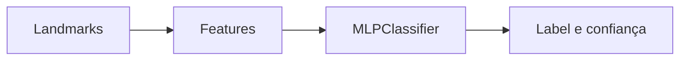
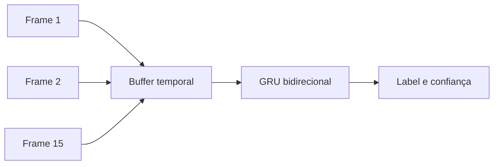

# Detectores de Machine Learning

O Li-Vision usa dois grupos de modelos de ML: estáticos e dinâmicos.

## ML estático

Modelos estáticos classificam um gesto a partir de um vetor de features de uma mão/frame.

| Item | Valor |
| --- | --- |
| Classe principal | `MLDetector` |
| Artefato | `.joblib` |
| Diretório | `models/static` |
| Modelo treinado | `MLPClassifier` |
| Melhor para | Letras/sinais sem movimento. |

Fluxo:

## ML dinâmico

Modelos dinâmicos classificam uma sequência de frames.

| Item | Valor |
| --- | --- |
| Classe principal | `LSTMGestureDetector` / detector GRU |
| Artefato novo | `.pt` |
| Artefato legado | `.joblib` |
| Diretório | `models/dynamic` |
| Melhor para | Sinais com movimento. |

Apesar do nome de algumas classes mencionar LSTM, o treinamento documentado usa GRU bidirecional em PyTorch.

Fluxo:

## Cache de modelos

`ModelCache` carrega e reutiliza modelos para evitar abrir arquivos a cada conexão.

`UserSession` cria detectores por sessão reaproveitando os modelos carregados no cache.

## Treinamento

| Dataset | Treinamento |
| --- | --- |
| `static` | MLP com scikit-learn. |
| `dynamic` | GRU bidirecional com PyTorch. |

O treinamento registra jobs, progresso, acurácia, relatório e artefatos.

## Compatibilidade de features

Modelos dependem do mesmo formato de features usado na coleta e na inferência.

Pontos críticos:

- `window_size`;
- quantidade de features por frame;
- schema `hands_v1` ou `holistic_v1`;
- labels/classes salvas no checkpoint;
- thresholds configurados.

## Quando usar cada modo

| Cenario | Modo recomendado |
| --- | --- |
| Letra simples já coberta por regra | `rules` |
| Gesto estático com variacao entre usuários | `ml` |
| Sinal com movimento | `dynamic_ml` |
| Produto em uso geral | `hybrid` |
