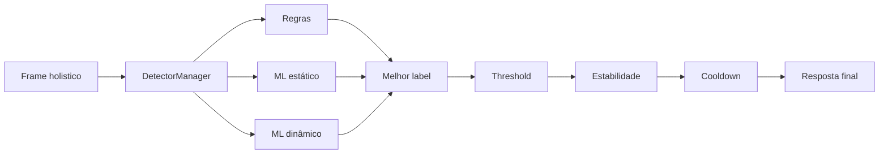

# Detectores

Detectores sao os componentes que recebem landmarks e tentam reconhecer um gesto.

No Li-Vision, eles sao executados pelo `DetectorManager`, que escolhe o melhor resultado e aplica estabilidade temporal.

## Tipos

| Tipo | Entrada | Melhor para |
| --- | --- | --- |
| Rule-Based | Uma mão com 21 landmarks | Letras/sinais simples e geometricamente claros. |
| ML estático | Vetor de features de uma mão | Gestos sem movimento, mas com variacao entre usuários. |
| ML dinâmico | Sequência de frames | Sinais que dependem de trajetoria temporal. |
| Híbrido | Todos os anteriores | Uso geral, combinando cobertura e flexibilidade. |

## Orquestracao



## Saída esperada

Todo detector deve retornar:

```python
(label, score)
```

Exemplos:

```python
("A", 0.95)
(None, 0.0)
```

## Cuidados

- Detectores estáticos recebem uma mão por vez.
- Detectores dinâmicos recebem o frame completo para preservar sequência e canais adicionais.
- Scores baixos sao descartados pelo threshold.
- Um gesto so e confirmado após estabilidade por varios frames.
