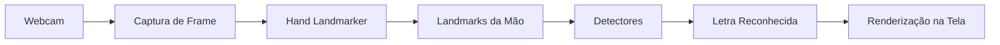

# Li-Vision

Bem-vindo ao **Li-Vision**, um sistema de **reconhecimento e interpretação de letras em Libras (Língua Brasileira de Sinais)** utilizando **visão computacional em tempo real**.

O projeto tem como objetivo explorar como técnicas modernas de **Computer Vision** e **Machine Learning** podem transformar movimentos das mãos capturados por uma webcam em interpretações digitais compreensíveis, servindo como base para sistemas de acessibilidade, pesquisa acadêmica e aprendizado em Inteligência Artificial.

---

## 🎯 Objetivo do Projeto

O Li-Vision foi desenvolvido para demonstrar, de forma prática e modular:

* Detecção de mãos em tempo real
* Extração de pontos anatômicos (landmarks)
* Interpretação geométrica de gestos
* Reconhecimento de letras da Libras
* Arquitetura extensível para IA e aprendizado de máquina

O sistema foi projetado também como **plataforma educacional**, permitindo compreender cada etapa do pipeline de visão computacional.

---

## 🧰 Tecnologias Utilizadas

Atualmente o projeto utiliza:

* **Python** — linguagem principal e camada backend do sistema
* **OpenCV** — captura da webcam e renderização visual dos frames
* **MediaPipe** — detecção da mão e geração dos landmarks 3D
* **Machine Learning** — classificação opcional baseada em modelos treinados
* **YAML Configuration** — controle dinâmico do modo de reconhecimento

---

## ⚙️ Como o Sistema Funciona

Quando a aplicação é iniciada, o seguinte fluxo acontece:

1. A webcam é ativada.
2. Cada frame do vídeo é capturado em tempo real.
3. O modelo de detecção identifica a mão presente na imagem.
4. São extraídos **21 pontos anatômicos (landmarks)** da mão.
5. Detectores analisam relações geométricas entre os pontos.
6. Uma letra da Libras é identificada e exibida na tela.

---

## 🔄 Pipeline de Reconhecimento



### Fluxo simplificado

```
Webcam → Landmarks → Detectores → Letra
```

---

## ✋ O que são Landmarks?

Landmarks são coordenadas espaciais que representam pontos específicos da mão, como:

* pulso
* articulações
* pontas dos dedos

Cada frame gera um conjunto de **21 pontos tridimensionais**, permitindo que o sistema entenda a posição e a curvatura dos dedos sem precisar analisar pixels diretamente.

Isso torna o reconhecimento:

✅ mais rápido
✅ independente de iluminação parcial
✅ robusto para tempo real

---

## 🧠 Modos de Reconhecimento

O Li-Vision suporta dois estilos de detecção:

### 🔹 Rule-Based (Heurístico)

Reconhecimento baseado em regras geométricas:

* distância entre dedos
* ângulo das articulações
* dedos abertos ou fechados

Ideal para aprendizado e prototipagem.

---

### 🔹 Machine Learning

Utiliza modelos treinados para classificar gestos automaticamente a partir dos landmarks.

Vantagens:

* maior escalabilidade
* reconhecimento mais flexível
* adaptação a variações de usuários

---

## 🏗️ Arquitetura do Projeto

O sistema foi dividido em módulos independentes:

```
src/
 ├── app.py              → ponto de entrada
 ├── pipeline/           → processamento de frames
 ├── detectors/          → reconhecimento das letras
 ├── recognition/        → gerenciamento dos detectores
 └── utils/              → funções auxiliares
```

Essa separação permite adicionar novas letras sem alterar o núcleo do sistema.

---

## 🚀 Principais Características

* Reconhecimento em tempo real
* Arquitetura modular
* Alternância entre IA e regras heurísticas
* Fácil expansão para novas letras
* Base para projetos de acessibilidade

---

## 📚 Para Onde Ir Agora

Se você está começando:

👉 Veja **Getting Started** para executar o projeto.

Se deseja entender o funcionamento interno:

👉 Consulte a seção **Arquitetura**.

Se quer criar novas letras:

👉 Acesse **Desenvolvimento de Detectores**.

---

## 💡 Visão Futuro

O Li-Vision pode evoluir para:

* reconhecimento de palavras completas
* tradução contínua de Libras
* integração com aplicações web/mobile
* assistentes de acessibilidade em tempo real

---

## 👨‍💻 Propósito Educacional

Este projeto foi construído com foco em aprendizado prático de:

* Visão Computacional
* Engenharia de Software
* Arquitetura modular
* Inteligência Artificial aplicada

---

> Li-Vision demonstra como movimentos humanos podem ser transformados em informação digital através da combinação entre matemática, visão computacional e inteligência artificial.
