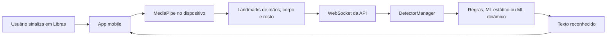

# Li-Vision

O **Li-Vision** é uma plataforma para tradução de sinais de Libras para texto em tempo real. O projeto combina aplicativo mobile, API Python, visão computacional, coleta de datasets, treinamento de modelos e documentação técnica em MkDocs.

O objetivo central é permitir que uma pessoa sinalize diante da câmera de um celular e receba uma interpretação textual do gesto, reduzindo dependência de hardware especial e mantendo o processamento visual mais pesado no próprio dispositivo sempre que possível.

## Visão geral

Na organização atual, os nomes com `_` identificam referências diferentes do mesmo repositório, usadas como variações de trabalho para separar responsabilidades do projeto:

| Referência | Papel no projeto |
| --- | --- |
| `Li-Vision_App` | Aplicativo Expo/React Native usado pelo usuário final e por administradores. |
| `Li-Vision_API` | Backend FastAPI responsável por autenticação, inferência, coleta, treinamento e gestão de modelos. |
| `Li-Vision_Principal` | Versão Python principal/espelhada do backend, com a mesma base de arquitetura para execução, testes locais e referência. |
| `Li-Vision_Docs` | Documentação oficial em MkDocs. Esta foi a única referência alterada nesta tarefa. |

## Como o Li-Vision funciona

```mermaid
flowchart LR
    U[Usuário sinaliza em Libras] --> A[App mobile]
    A --> M[MediaPipe no dispositivo]
    M --> L[Landmarks de mãos, corpo e rosto]
    L --> W[WebSocket da API]
    W --> D[DetectorManager]
    D --> R[Regras, ML estático ou ML dinâmico]
    R --> T[Texto reconhecido]
    T --> A
```

1. O usuário abre a tela de câmera no aplicativo.
2. O app usa MediaPipe para extrair landmarks no próprio dispositivo.
3. Os landmarks sao enviados para a API por WebSocket.
4. A API cria uma sessão isolada para a conexão.
5. O `DetectorManager` executa detectores baseados em regras, modelos estáticos, modelos dinâmicos ou modo híbrido.
6. O resultado volta para o app como gesto e confiança.
7. O app exibe a transcrição e pode usar recursos como soletramento e síntese de voz.

## Capacidades principais

| Área | Recursos |
| --- | --- |
| Tradução em tempo real | Câmera, landmarks on-device, WebSocket e resposta contínua. |
| Detecção | Modos `rules`, `ml`, `dynamic_ml` e `hybrid`. |
| Coleta | Amostras estaticas e sequências dinamicas para datasets. |
| Treinamento | MLP para sinais estáticos e GRU bidirecional para sinais dinâmicos. |
| Aprendizado | Cadastro e exibição de gestos por nível, categoria e módulo. |
| Administração | Modelos, datasets, configuração de regras e acompanhamento de treino. |
| Acessibilidade | Tradução visual, transcrição e text-to-speech. |

## Onde continuar

| Se você quer entender... | Leia |
| --- | --- |
| A estrutura geral do projeto | [Arquitetura geral](architecture/overview.md) |
| O fluxo de landmarks até a resposta | [Fluxo de dados](architecture/data-flow.md) |
| O backend e seus módulos | [Backend API](modules/backend-api.md) |
| O aplicativo mobile | [Aplicativo mobile](modules/mobile-app.md) |
| Os endpoints disponíveis | [Referência da API](api-reference.md) |
| Como rodar localmente | [Começando](getting-started.md) |
| Como configurar modos e modelos | [Configuração](configuration.md) |

## Estado documentado

Esta documentação foi escrita a partir das referências existentes do projeto, incluindo arquivos de configuração, rotas FastAPI, serviços Python, telas Expo e documentação já presente nas variações do repositório.

Quando houver divergência entre esta documentação e o código, o código deve ser tratado como fonte primária até que a documentação seja atualizada.
